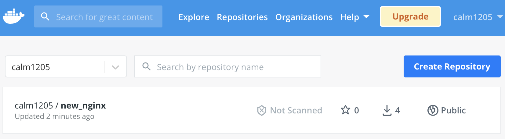

# publish docker image

[docker_hub](https://hub.docker.com/repositories)

## image を tag 付け

```bash
# docker tag <image> <docker_hub_username>/<repo_name>
docker tag new_nginx calm1205/new_nginx

# tag付けを確認
docker images
# REPOSITORY           TAG       IMAGE ID       CREATED          SIZE
# calm1205/new_nginx   latest    c7ae333ccf7b   17 minutes ago   159MB
# new_nginx            latest    c7ae333ccf7b   17 minutes ago   159MB

# -> 同じ image_idで<user_name>/<repo_name>のimageが作成される。
```

## docker に login

```bash
docker login
```

## docker hub に push

```bash
# docker push <docker_hub_username>/<repo_name>
docker push calm1205/new_nginx
```


